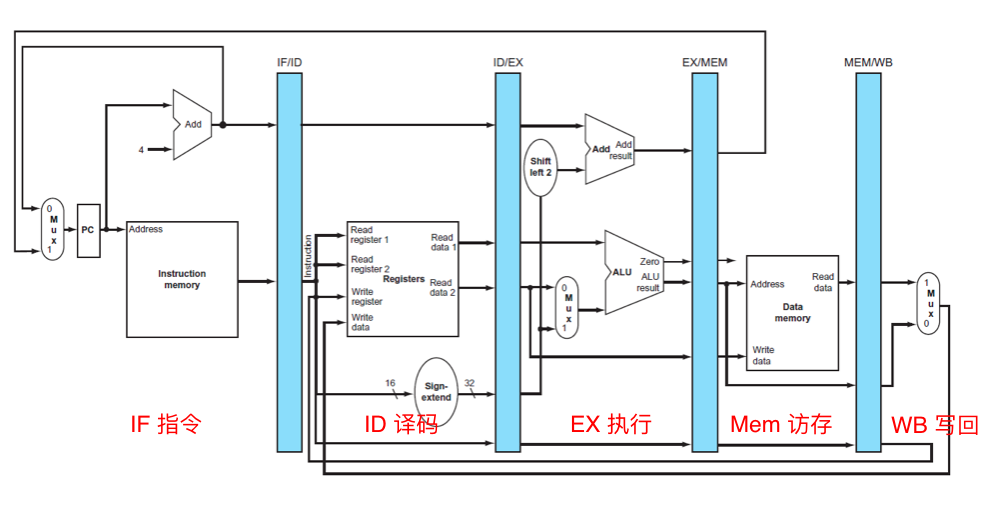
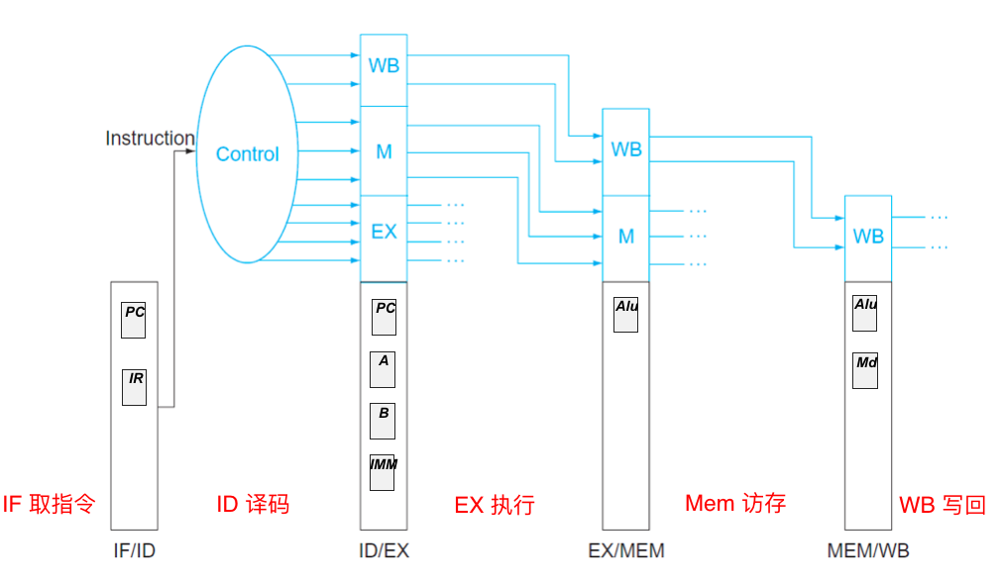
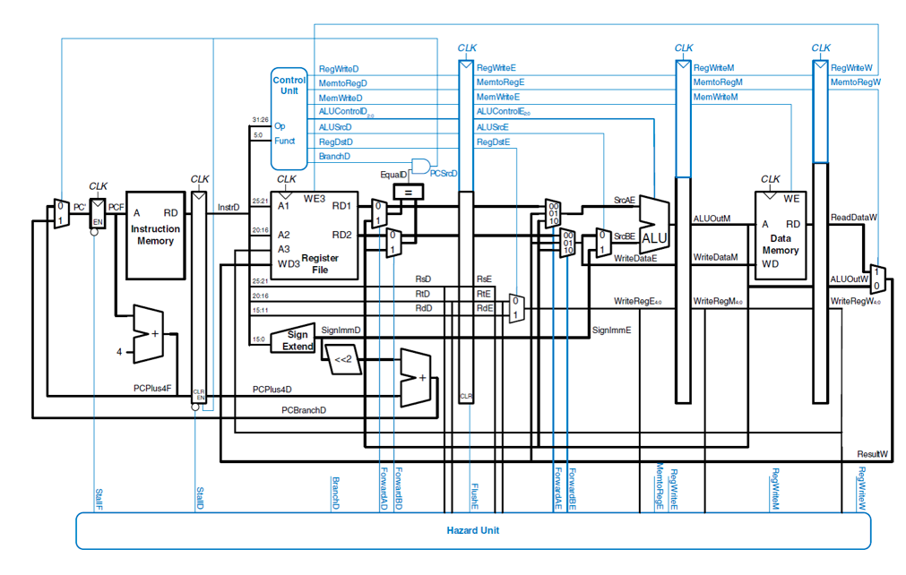

## 可支持理想流水线的多周期CPU设计
### 总体设计
在单周期CPU的基础上, 将指令周期分为如下部分
- 取指令      IF    (Instruction Fetch)
- 指令译码    ID    (Instruction Decode)
- 执行运算    EX   (Execution)
- 访存阶段    MEM
- 结果写回    WB  (Write Back)

并通过四个锁存器讲以上五个部分分离开来. 结构如[图 3.2](#mul_cpu)所示

图 3.2 多周期CPU结构图

ID段译码生成该指令的所有控制信号, 满足如下要求
- 控制信号向后传递
- 后续部件控制信号不再单独生成
- 单周期CPU实现中的控制器在ID段复用

控制信号的传输如[图 3.3](#flag_tr)

### 接口部件设计
接口部件由一组寄存器实现,在指令传输的过程中需要分为四个锁存器与五段周期：取指令周期(IF), 指令译码(ID), 执行运算(EX)
访存阶段(MEM), 结果写回(WB).

- 取指令周期 以PC中存放的内容作为指令存放的地址, 从存储器中取指令并存入指令寄存器(IR), 同时将PC中的值自动加“逻辑1”, 因为指令长度为32位, 则PC+4=PC, 以此类推, PC指向下一跳执行指令的首地址.

图 3.3 控制信号的传输

- 指令译码 此周期内会对指令进行译码, 以指令中地址码的结果作为地址访问通用寄存器组, 把读出的操作数分别送入ALU的两个操作数.

- 地址计算周期 此周期内, ALU对ID周期准备好的操作数进行算术运算和逻辑运算.

- 存储器访问周期 在这个周期内, 只有LOAD/STORE指令和分支指令需要进行操作, 其他指令不做任何操作.对于该指令,就是用上一个周期计算出来的有效地址从存储器中读出数据或将指定的数据写入有效地址指定的存储单元;对于分支指令, 如果前一个周期判断分支, 就将目标地址送入PC.

- 结果写回 在此周期内, 只有ALU运算指令和LOAD指令需要进行写操作, 将运算结果写入通用寄存器组, 其他指令不操作.

### 流水冲突检测器
由于多条指令在同一时钟周期都需要使用同一操作部件而引起的冲突被称为结构冲突.

应在指令译码(ID)段进行检测, 而且不同类型指令有区分
- R型指令 涉及两个源操作数Rs,Rt
- I型指令 涉及一个或两个源操作数Rs(Lui无相关)
- 其他分支指令(Beq,Bne, Bgt) 涉及两个源操作数Rs,Rt
- J型指令(无相关,直接产生分支相关信号)
- 相关数据需与后续段中的结果寄存器编号比较
    - EX.WriteReg   Mem.WriteReg    WB.WriteReg
    - 写回信号

流水线的相关冲突
- 资源相关
    - 取操作数与取指令都需要访问主存
    - 多周期方案中计算PC、分支地址,运算指令  复用ALU
    - 增加部件消除
- 数据相关
    - 指令操作数依赖于前一条指令的执行结果
    - 引起流水线停顿直到数据写回
- 分支相关
    - 转移指令使得流水线发生中断
    - 提前取出指令作废,流水线清空

增加相关检测判定逻辑
- 当前指令读寄存器编号与后续3条指令写寄存器编号相同
- 当前指令可能有0~2个读寄存器
- 后续3条指令可能有0~1个写寄存器

### 插入气泡的流水冲突处理
插入气泡(空操作)
- 向后段插入气泡(接口信号清零,最关键的是写回信号)
- 向前给出阻塞信号(流水线停顿)避免当前指令被新指令取代

气泡处理流程, 如[表 3.2](#nop_flows)所示

### 数据重定向的流水冲突处理
由于数据冲突使得进程所需的周期数大大增加, 因此改进为数据重定向.
如果ALU阶段的指令和访存阶段或者写入阶段的指令冲突, 则构建新的数据通路, 若不冲突则是用原来的数据;
分支跳转指令则操作方式不变;

数据重定向bypass(数据旁路)
- 将后端处理后的数据(还没来得及写回)重定向
- 数据在哪就从哪送到运算器

### 动态分支预测的流水冲突处理
通过预测降低分支指令对流水线的影响
缓冲近期执行过的分支指令的PC以及对应分支地址, 取指时通过全相联查找.

本实验采用双预测位.
最终得到全冒险处理机制的流水CPU, 如[图 3.4](#all_conflict)所示.

表 3.2 气泡处理流程

 IF | ID  | EX | MEM | WB | Note
----|-----|----|-----|----|-------
 1  |     |    |     |    |
 2  |  1  |    |     |    |
 3  |  2  |  1 |     |    |
 4  |  3  |  2 |  1  |    | 指令4与3数据相关
 5  |  4  |  3 |  2  |  1 | 指令4 ID段不能取到正确数据
 5  |  4  | nop|  3  |  2 | 相关插入气泡, 前段暂停
 5  |  4  | nop| nop |  3 | 仍然相关, 继续插入气泡
 5  |  4  | nop| nop | nop| 仍然相关, 继续插入气泡
 6j |  5  |  4 | nop | nop| 相关解除, 流水线继续
 7  |  6j | 5  | 4   | nop| 指令6为跳转指令
 8  |  7  | 6j | 5   |  4 |
 15 | nop | nop| 6j | 5  | 清空误取的指令, 同步清空
 16 | 15  | nop| nop| 6j |

 
 
图 3.4 全冒险处理机制的流水CPU

