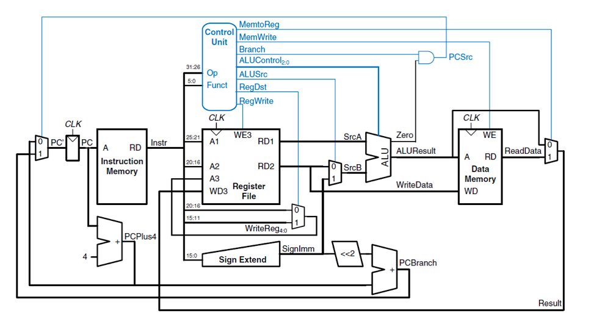
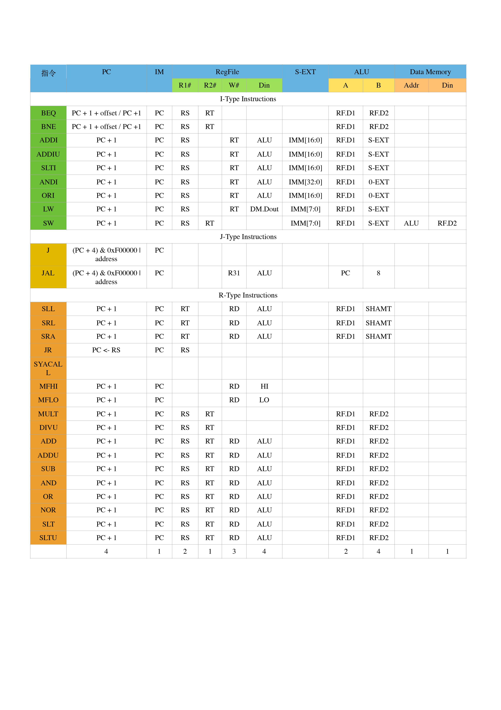

## 构建单周期CPU
### 总体设计
本次单周期CPU的构建采用的是自顶向下的设计思路.

先根据单周期CPU所需要实现的功能, 实现这些功能需要执行哪些操作, 将其划分为取指令、译码、产生控制信号、读寄存器堆、运算、访存、写回等功能模块, 每个功能模块负责其中的一步操作.

对于每一个功能模块, 根据所要执行的操作, 在Logisim软件平台上选择适当的电路部件搭建正确的逻辑电路并进行封装.

所有模块的逻辑电路搭建封装完成后, 根据每个模块所执行的操作在整个指令执行流程中的顺序, 将所有模块连接在一起, 然后编写一段程序来检验单周期CPU的正确性.

总体结构图如[图 3.1](#struct)所示

图 3.1 总体结构图

### 主要功能部件
1. 程序计数器PC

2. 指令存储器IM

指令存储器ROM只由一个地址位宽为24和数据位宽为32的ROM组成.

3. 寄存器堆RF

寄存器堆Reg由32个寄存器组成, 在单周期CPU中, 同一时刻对于同一个寄存器的读写操作可能会造成冲突.

4. 数据存储器DM

数据选择器由一块RAM芯片组成, 地址位宽为24和数据位宽为32, 采用分离的加载和存储数据接口

5. 控制单元controlunit

控制中心的输入是每条指令的opcode字段和funct字段.
由于R型指令的操作选择字段是funct, I型和J型指令的操作选择字段是OP, 通过产生一个字段可以对R、I、J三种指令的操作作出选择.
通过观察28条指令的特点, 将输出端的信号经过逻辑门连在一起形成新的控制信号, 用于控制后续程序的工作.

6. 运算器ALU

运算部件详见[附表 2](../section9/README.md#op).
两个源操作数均经过这些运算器运算后得到八个结果, 然后用一个数据选择器从中选择一个结果作为输出, 数据选择器的数据选择端为ALUop, 由控制中心controlunit产生.

### 指令构造
- 构造R型指令

这些R指令的都由一个为0的操作码决定, 并且通过其funct值区分, 除了前三个指令, 这些操作只包括寄存器, 另外除了算数运算, 还包括跳转和系统调用指令.
其RTL描述详见[附表 4](../section9/README.md#r_instr)

- 构造J型指令

其RTL描述详见[附表 3](../section9/README.md#j_instr)

- 构造I型指令

所有这些指令有一个需要扩展到32位的16位立即数(除了那些不需要0扩展的指令), branch指令有效的将立即数左移两位, 得到一个字节偏移量.
其RTL描述详见[附表 5](../section9/README.md#i_instr)

- DISP指令 halt指令

通过对指令RTL的分析, 得到数据通路表, 如[表 3.1](#instr_d)

所有指令的数据通路表详见[附表 6](../section9/README.md#instr_d_all)

表 3.1 数据通路表

