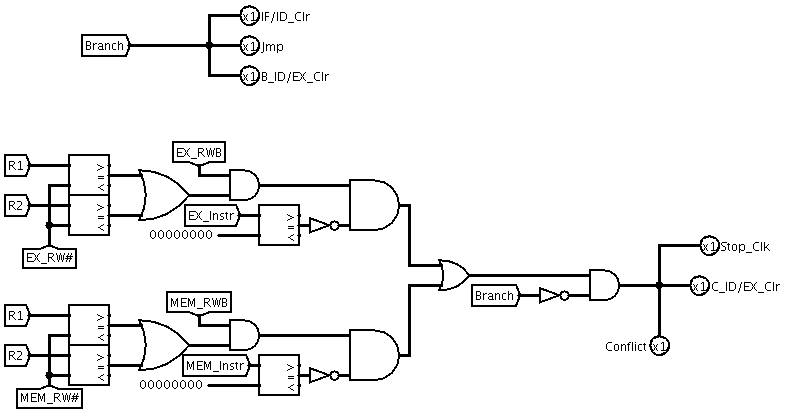

## 流水线冲突检测器
流水线冲突分为数据冲突和分支跳转冲突.
在产生数据冲突时,需要插入气泡延后下条指令的执行,当冲突结束后才能让PC继续增加;
当发生跳转的时候,将跳转之前的所有缓冲区全部清空,达到插入气泡的效果.

具体见[图 4.6](#conflict)

流水冲突检测的具体实现原理为:
1. 对于执行阶段的指令, 如果是分支指令, 并且成功跳转, 则将IF/ID, ID/EX 锁存器清零

2. 对于EX以及MEM阶段的指令, 解析其指令格式, 解析出指令类型, 需要读的地址, 并与ID阶段比较, 若有重叠则存在冲突, 向寄存器中写气泡, 并且前段停止.

图4.6 流水线冲突检测器

