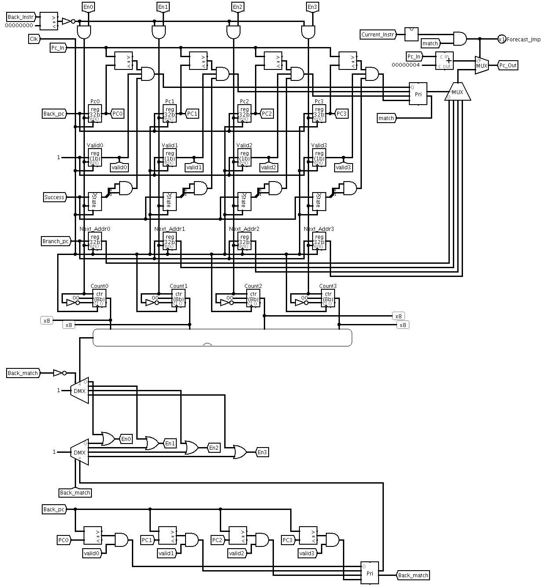
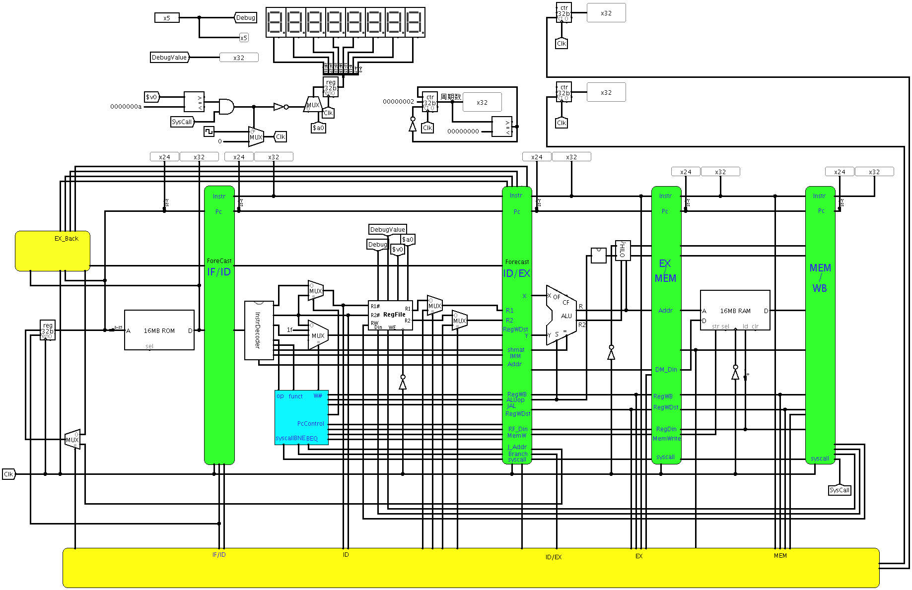

## 动态分支预测的流水冲突处理
设置BTB表, 详见[图 4.10](#btb)缓冲近期执行过的分支指令的PC以及对应分支地址, 本设计中BTB采用双预测位.

图 4.10 BTB

处理流程如下:
1. 判断当前指令是否为跳转指令, 是转第二步

2. 全相联查找BTB表, 找到转第三步, 否则转第四步

3. 从BTB表中找到相关信息, 是否跳转等, 继续执行

4. 在执行阶段, 将跳转指令信息写回, 更新BTB表

动态分支预测的流水冲突处理具体实现见[图 4.11](#conflict_forecast)

图 4.11 动态分支预测的流水冲突处理CPU

