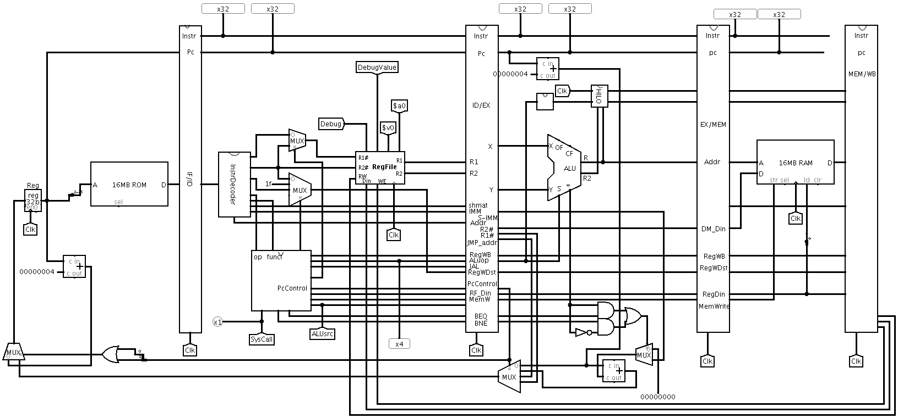

## 可支持理想流水线多周期CPU
在单周期CPU的基础上, 将指令周期分为如下部分
- 取指令      IF    (Instruction Fetch)
- 指令译码    ID    (Instruction Decode)
- 执行运算    EX   (Execution)
- 访存阶段    MEM
- 结果写回    WB  (Write Back)

并通过四个锁存器讲以上五个部分分离开来.
并在ID段译码生成该指令的所有控制信号, 满足如下要求
- 控制信号向后传递
- 后续部件控制信号不再单独生成
- 单周期CPU实现中的控制器在ID段复用

可支持理想流水线多周期CPU如[图 4.5](#mul_cpu)

图4.5 可支持理想流水线多周期CPU

