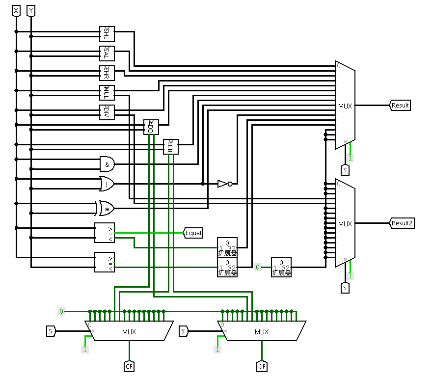
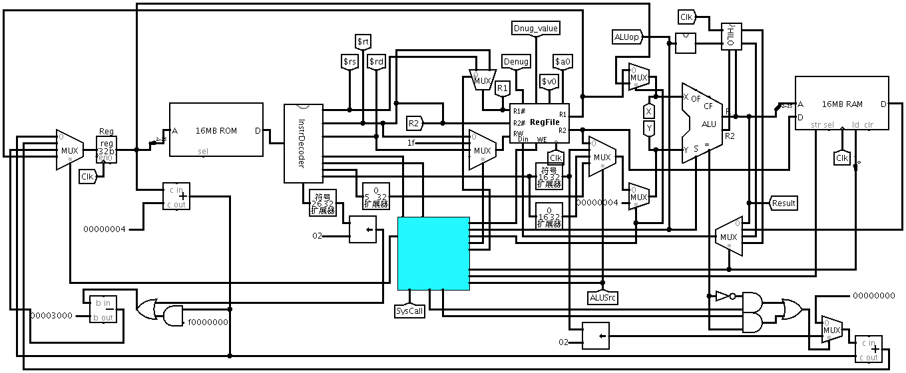

## 构建单周期CPU
### 主要功能部件实现
#### 程序计数器PC
##### 选用的元器件
- 寄存器(数据位宽: 32, 触发方式: 上升沿, 标签: Reg)
- 多路选择器

##### 输入
- 时钟信号
- 地址输入: 下条指令的地址
- 选择信号

##### 输出
- 寄存器的输出端.

##### 具体实现
计数器的时钟端连线时钟隧道,时钟隧道连接一个非门,然后接到寄存器的时钟端,
清零隧道直接连接计数器和寄存器的清零端,计数器的输出端连接寄存器的数据段,具体电路见[图 4.1](#pc).

图4.1 程序计数器PC实现图  图4.3 InstrDecoder

#### 运算器ALU
一个32位运算器,可支持算数加、减、乘、除,逻辑与、或、非、异或运算、逻辑左移、逻辑右移,算术右移运算,
支持常用程序状态标志(有符号溢出OF、无符号溢出CF,结果相等Equal),运算器功能以及输入输出引脚见[表 4.1](#alu_des)

表4.1 运算器引脚与功能描述

   PIN   | I/O | Bit-width | Describe
---------|-----|-----------|---------
 X       | IN  | 32        | 操作数X
 Y       | IN  | 32        | 操作数Y
 ALU_OP  | IN  | 4         | 运算器功能码,具体功能见下表
 Result  | OUT | 32        | ALU运算结果
 Result2 | OUT | 32        | ALU结果第二部分,用于乘法指令结果高位或除法指令的余数位,其他操作为零
 OF      | OUT | 1         | 有符号加减溢出标记,其他操作为零
 CF      | OUT | 1         | 无符号加减溢出标记,其他操作为零
 Equal   | OUT | 1         | Equal=(x==y)?1:0, 对所有操作有效

硬件原理如[图 4.2](#alu_struct)所示.

#### InstrDecoder

指令译码器将指令译码取出各个部分, 具体见[图 4.3](#InstrDecoder). 此处不再赘述.

#### ControlUnit
##### PcControl
- I-Type

$$ PcControl1 = \overline{op5} \cdot \overline {op3} \cdot \overline {op2}$$

$$ PcControl0 = \overline{op5} \cdot \overline {op3} \cdot op2 $$

- R-Type

$$ PcControl1 = \overline{Fun4} \cdot Fun3 \cdot \overline{Fun1} $$

$$ PcControl0 = \overline{Fun4} \cdot Fun3 \cdot \overline{Fun1} $$

##### 写寄存器位置
- I-Type

图4.2 运算器硬件原理

$$ RegWriteDst1 = 0 $$

$$ RegWriteDst0 =\overline{op5}  \cdot \overline{op4} \cdot \overline{op3} \cdot \overline{op2} \cdot op1 \cdot
op0 $$

- R-Type

 $$ RegWriteDst1 = 1 $$ 

 $$ RegWriteDst0 = 0 $$ 

##### R1
- I-Type

 $$ R1 = 1 $$ 

- R-Type

 $$ R1 =  \overline{Fun5} \cdot \overline{Fun4} \cdot \overline{Fun3} $$ 

##### R2

 $$ R2 = \overline{Fun2} + Fun5 $$ 

##### DM_Din

 $$ DMDin1 = op1 $$ 

 $$ DMDin0 = \overline{op1} \cdot op0 $$ 

##### MemWrite

$$ MW = op5 \cdot \overline{op4} \cdot op3 \cdot \overline{op2} \cdot \overline{op1} + op5 \cdot \overline{op4} \cdot op3 \cdot \overline{op2} \cdot op0 $$

##### RF_Din
- I—Type

 $$ RFDin1 = 0 $$ 

 $$ RFDin0 = \overline{op3} $$ 

- R-Type

 $$ RFDin1 = Fun4 $$ 

 $$ RFDin0 = Fun4 \cdot Fun0 $$ 

##### ALUop
- I-Type

 $$ ALUOP_3 = op1 \cdot \overline{op0} + op2 \cdot op0 $$ 

 $$ ALUOP_2 = \overline{op1} \cdot \overline{op0} + \overline{op2} \cdot op0 $$ 

 $$ ALUOP_1 = op1 \cdot \overline{op0} + op2 \cdot \overline{op0} $$ 

 $$ ALUOP_0 = \overline{op2} + \overline{op0} $$ 

- R-Type

 $$ ALUOP_3 = Fun2 \cdot Fun0 + \overline{Fun4} \cdot Fun3 $$ 

 $$ ALUOP_2 = Fun2 \cdot \overline{Fun0} + Fun3 \cdot Fun0 + Fun5 \cdot \overline{Fun3} \cdot \overline{Fun2} $$ 

 $$ ALUOP_1 = Fun1 \cdot \overline{Fun0} + Fun2 \cdot \overline{Fun0} + Fun2 \cdot Fun1 + Fun4 \cdot \overline{Fun0} $$ 

 $$ ALUOP_0 = \overline{Fun3} \cdot \overline{Fun2} \cdot Fun0 + Fun3 \cdot \overline{Fun0} + Fun5 \cdot \overline{Fun1} \cdot \overline{Fun0} $$ 

##### RegWriteBack
- I-Type

 $$ RWB = \overline{op5} \cdot \overline{op4} \cdot op3 + op5 \cdot \overline{op4} \cdot \overline{op3} \cdot \overline{op1} + op5 \cdot \overline{op4} \cdot \overline{op3} \cdot \overline{op2} \cdot op0 $$ 

- R-Type

$$
RWB = \overline{Fun5} \cdot \overline{Fun3} \cdot \overline{Fun2} \cdot \overline{Fun0} + \overline{Fun4} \cdot \overline{Fun3} \cdot \overline{Fun0} + \overline{Fun4} \cdot \overline{Fun3}
\cdot Fun1
$$

$$ + \overline{Fun5} \cdot \overline{Fun4} \cdot Fun3 \cdot \overline{Fun2} \cdot
\overline{Fun1} \cdot Fun0
$$

$$+ Fun5 \cdot \overline{Fun4} \cdot \overline{Fun3} + Fun5 \cdot
\overline{Fun4} \cdot \overline{Fun2} \cdot Fun1
$$

##### ALUsrc
- I-Type

 $$ ALU_1 = op3 \cdot op2 $$ 

 $$ ALU_0 = \overline{op2} + op5 $$ 

- R-Type

 $$ ALU_1 = \overline{Fun5} \cdot \overline{Fun3} \cdot \overline{Fun2} $$ 

 $$ ALU_0 = \overline{Fun5} \cdot \overline{Fun3} \cdot \overline{Fun2} $$ 

### 总体结构
单周期CPU总体结构如[图 4.4](#Single_Cpu), 已经除去多余信息(如数码管显示等)

图4.4 单周期CPU结构图

