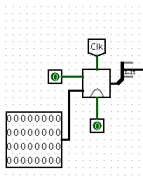
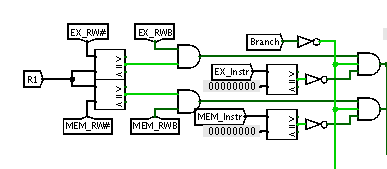
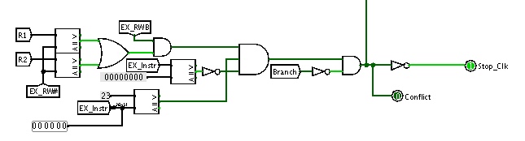
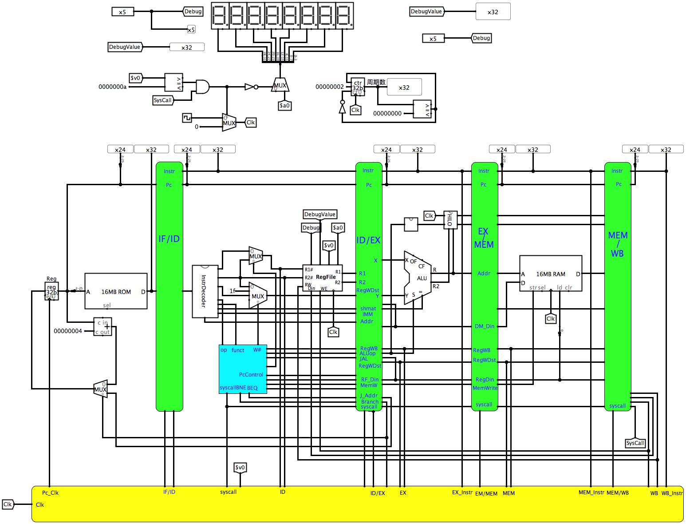

## 主要故障与调试
### 故障1
- 故障现象: 启动了时钟后,加载镜像后,无线循环下去了
- 原因分析: 在跳转时,由于在执行jr指令时, 由于rs数错误或上条指令执行写入错误的寄存器写入寄存器时, 数据来源错误, 也就是控制单元出错
- 解决方案: 修改寄存器写入来源控制, 以便正确的寄存器地址写入R1

### 故障2
- 故障现象: 见[图 5.1](#bug2)
- 原因分析: 在子单元中, 没个时钟周期加1, 外部调用后每4个时钟周期加一.
- 解决方法: 在子单元中以及外部调用时, 确实是每个时钟周期加一, 但由于地址从第三位算起, 故而在外部调用时每4个时钟周期加一

图5.1 故障2

### 故障3
- 故障现象: 译码以后的操作, 指令错误的更新为0000
- 原因分析: 在处理数冲突时, 未对nop指令处理, 导致在执行与0号寄存器相关的指令时, 错误的认为数据相关, 导致锁存器同步清零
- 解决方案: 在处理数据相关时, 将nop指令除开, 具体处理见[图 5.2](#bug3_handle)

图5.2 故障3处理

### 故障4
- 故障现象: 插入气泡的停机指令不正确
- 故障原因: 停机指令在刚进入流水时就执行了而不是最后一句指令执行后才停机
- 解决方案: 在最开始的地方生成停机指令, 并将停机指令不断往后传

### 故障5
- 故障现象: 在处理数据冲突时, *jal* 指令执行时, *PC* 时钟停止
- 原因分析: jump指令检测到数据相关冲突, 故而停止 *PC* 以及 *IF/ID* 锁存器时钟
- 解决方案: 在处理数据相关时, 将jump指令除开, 具体处理见[图 5.3](#bug5_handle)

图5.3 故障5处理

### 故障6
- 故障现象: 启动了时钟后,加载镜像后,无限循环下去了
- 原因分析: 跳转指令出错
- 解决方案: 检查发现j指令16进制代码错误, 08000006 变为080000c06, 修正跳转指令

### 故障7
- 故障现象: *PC* 变化, 而指令并没有向前传递, 具体见[图 5.4](#bug7)
- 原因分析: 时钟问题
- 解决方案: 将数据读写修改为上升沿读, 下降沿写

图5.4 故障7

