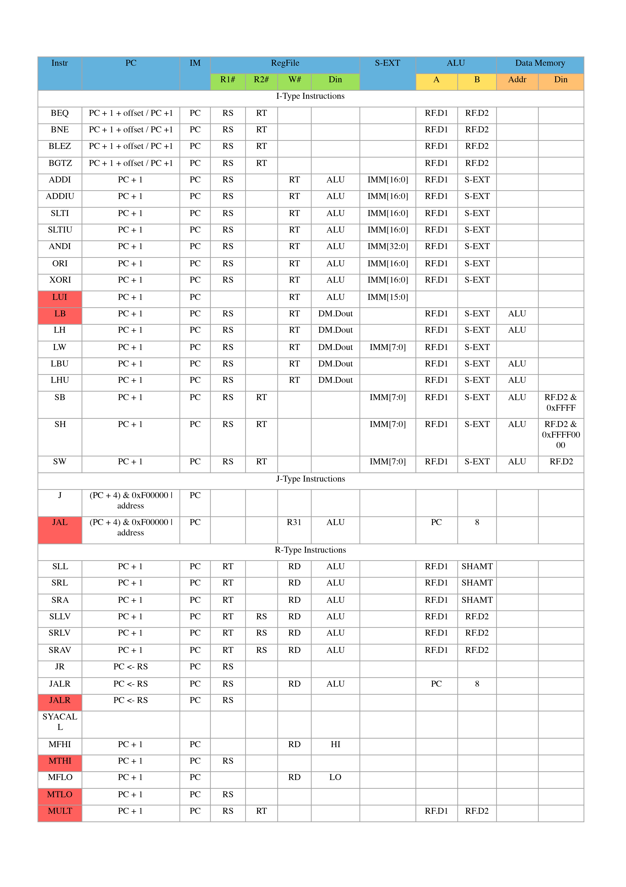
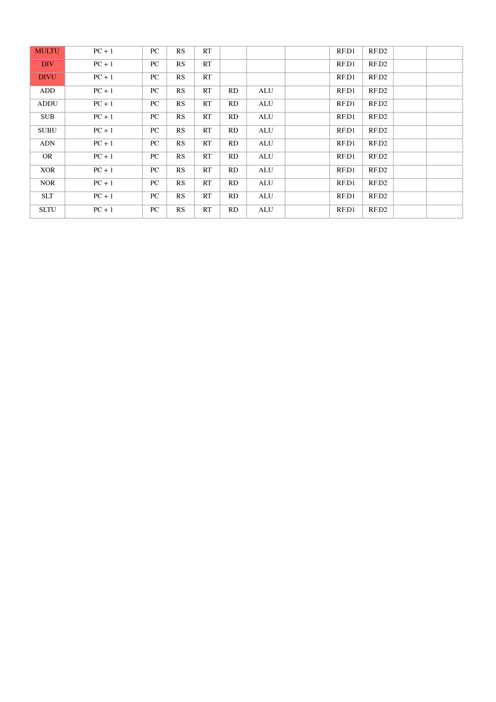

## 附录

附表 1 指令格式

   |        Instruction         | 格式
---|----------------------------|-------
1  | Add                        | add $rd, $rs, $rt
2  | Add Immediate              | addi $rt, $rs, immediate
3  | Add Immediate Unsigned     | addiu $rt, $rs, immediate
4  | Add Unsigned               | addu $rd, $rs, $rt
5  | And                        | and $rd, $rs, $rt
6  | And Immediate              | andi $rt, $rs, immediate
7  | Shift Left Logical         | sll $rd, $rt, shamt
8  | Shift Right Arithmetic     | sra $rd, $rt, shamt
9  | Shift Right Logical        | srl $rd, $rt, shamt
10 | Sub                        | sub $rd, $rs, $rt
11 | Or                         | or $rd, $rs, $rt
12 | Or Immediate               | ori $rt, $rs, immediate
13 | Nor                        | nor $rd, $rs, $rt
14 | Multiply                   | mult $rs, $rt
15 | Move from Hi               | mfhi $rd
16 | Move from Lo               | mflo $rd
17 | Divide Unsigned            | divu $rs, $rt
18 | Load Word                  | lw $rt, offset($rs)
19 | Store Word                 | sw $rt, offset($rs)
20 | Branch on Equal            | beq $rs, $rt, label
21 | Branch on Not Equal        | bne $rs, $rt, label
22 | Set Less Than              | slt $rd, $rs, $rt
23 | Set Less Than Immediate    | slti $rt, $rs, immediate
24 | Set Less Than Unsigned     | sltu $rd, $rs, $rt
25 | Jump                       | j label
26 | Jump and Link              | jal label
27 | Jump Register              | jr $rs
28 | syscall(display or exit)   | syscall

附表 2 运算符功能

ALU OP | 十进制 | 运算功能
-------|-------|------
0000   |   0   | Result = X << Y
0001   |   1   | Result = X >>> Y
0010   |   2   | Result = X >> Y
0011   |   3   | Result = (X * Y)[31:0];    Result2 = (X * Y)[63:32]
0100   |   4   | Result = X / Y;    Result2 = X % Y
0101   |   5   | Result = X + Y(Set OF/CF)
0110   |   6   | Result = X - Y(Set OF/CF)
0111   |   7   | Result = X & Y
1000   |   8   | Result = X or Y
1001   |   9   | Result = X ⊕ Y
1010   |   10  | Result = ~(X or Y)
1011   |   11  | Result = (X < Y) ? 1 : 0 Signed
1100   |   12  | Result = (X < Y) ? 1 : 0 Unsigned

附表 3 J-Type Instructions

Instruction         | RTL
--------------------|-----
j address           | PC ← {(PC + 4)[31:28], address, 00}
jal address         | R[31] ← PC + 8 PC ← {(PC + 4)[31:28], address, 00}

附表 4 R-Type Instructions

   Instruction      |                       RTL                       | Notes
--------------------|-------------------------------------------------|------
sll $rd, $rt, shamt | R[$rd]← R[$rt] << shamt                         |
srl $rd, $rt, shamt | R[$rd]← R[$rt] >> shamt                         | Unsigned right shift
sra $rd, $rt, shamt | R[$rd]← R[$rt] >> shamt                         | Signed right shift
sllv $rd, $rt, $rs  | R[$rd]← R[$rt] << R[$rs]                        |
srlv $rd, $rt, $rs  | R[$R[$rt] >> R[$rs]                             | Unsigned right shift
srav $rd, $rt, $rs  | R[$rd] ← R[$rt] >> R[$rs]                       | Signed right shift
jr $rs              | PC ← R[$rs]                                     | R[$rs] must be a multiple of 4
jalr $rd, $rs       | R[$rd] ← PC + 8 PC ← R[$rs]                     |
jalr $rs            |                                                 |
syscall             | System Call                                     |
mfhi $rd            | R[$rd] ← HI                                     |
mthi $rs            | HI ← R[$rs]                                     |
mflo $rd            | R[$rd] ← LO                                     |
mtlo $rs            | LO ← R[$rs]                                     |
mult $rs, $rt       | {HI, LO} ← R[$rs] * R[$rt]                      | Signed multiplication
multu $rs, $rt      | {HI, LO} ← R[$rs] * R[$rt]                      | Unsigned multiplication
div $rs, $rt        | {HI, LO} ← R[$rs] %/ R[$rt]                     | Signed division
divu $rs, $rt       | {HI, LO} ← R[$rs] %/ R[$rt]                     | Unsigned division
add $rd, $rs, $rt   | R[$rd] ← R[$rs] + R[$rt]                        | Exception on signed overflow
addu $rd, $rs, $rt  | R[$rd] ← R[$rs] + R[$rt]                        |
sub $rd, $rs, $rt   | R[$rd] ← R[$rs] - R[$rt]                        | Exception on signed overflow
subu $rd, $rs, $rt  | R[$rd] ← R[$rs] - R[$rt]                        |
and $rd, $rs, $rt   | R[$rd] ← R[$rs] & R[$rt]                        |
or $rd, $rs, $rt    | R[$rd] ← R[$rs] or R[$rt]                       |
xor $rd, $rs, $rt   | R[$rd] ← R[$rs] ^ R[$rt]                        |
nor $rd, $rs, $rt   | R[$rd] ← !(R[$rs] or R[$rt])                    |
slt $rd, $rs, $rt   | R[$rd] ← R[$rs] < R[$rt]                        | Signed comparison
sltu $rd, $rs, $rt  | R[$rd] ← R[$rs] < R[$rt]                        | Unsigned comparison

附表 5 I-Type Instructions

Instruction         |   RTL                                                     |  Notes
--------------------|-----------------------------------------------------------|----------
beq $rs, $rt, imm   | if(R[$rs] = R[$rt]) PC ← PC + 4 + SignExt18b({imm, 00})   |
bne $rs, $rt, imm   | if(R[$rs] != R[$rt]) PC ← PC + 4 + SignExt18b({imm, 00})  |
blez $rs, imm       | if(R[$rs] <= 0) PC ← PC + 4 + SignExt18b({imm, 00})       | Signed comparison
bgtz $rs, imm       | if(R[$rs] > 0) PC ← PC + 4 + SignExt18b({imm, 00})        | Signed comparison
addi $rt, $rs, imm  | R[$rt] ← R[$rs] + SignExt16b(imm)                         | Exception on signed overflow
addiu $rt, $rs, imm | R[$rt] ← R[$rs] + SignExt16b(imm)                         |
slti $rt, $rs, imm  | R[$rt] ← R[$rs] < SignExt16b(imm)                         | Signed comparison
sltiu $rt, $rs, imm | R[$rt] ← R[$rs] < SignExt16b(imm)                         | Unsigned comparison
andi $rt, $rs, imm  | R[$rt] ← R[$rs] & {0 × 16, imm}                           |
ori $rt, $rs, imm   | R[$rt] ← R[$rs] or {0 × 16, imm}                          |
xori $rt, $rs, imm  | R[$rt] ← R[$rs] ^ {0 × 16, imm}                           |
lui $rt, imm        | R[$rt] ← {(imm)[15:0], 0 × 16}                            |
lb $rt, imm($rs)    | R[$rt] ← SignExt8b(Mem1B(R[$rs] + SignExt16b(imm)))       |
lh $rt, imm($rs)    | R[$rt] ← SignExt16b(Mem2B(R[$rs] + SignExt16b(imm)))      | Computed address must be a multiple of 2
lw $rt, imm($rs)    | R[$rt] ← Mem4B(R[$rs] + SignExt16b(imm))                  | Computed address must be a multiple of 4
lbu $rt, imm($rs)   | R[$rt] ← {0 × 24, Mem1B(R[$rs] + SignExt16b(imm))}        |
lhu $rt, imm($rs)   | R[$rt] ← {0 × 16, Mem2B(R[$rs] + SignExt16b(imm))}        | Computed address must be a multiple of 2
sb $rt, imm($rs)    | Mem1B(R[$rs] + SignExt16b(imm)) ← (R[$rt])[7:0]           |
sh $rt, imm($rs)    | Mem2B(R[$rs] + SignExt16b(imm)) ← (R[$rt])[15:0]          | Computed address must be a multiple of 2
sw $rt, imm($rs)    | Mem4B(R[$rs] + SignExt16b(imm)) ← R[$rt]                  | Computed address must be a multiple of 4

附表 6 数据通路表

